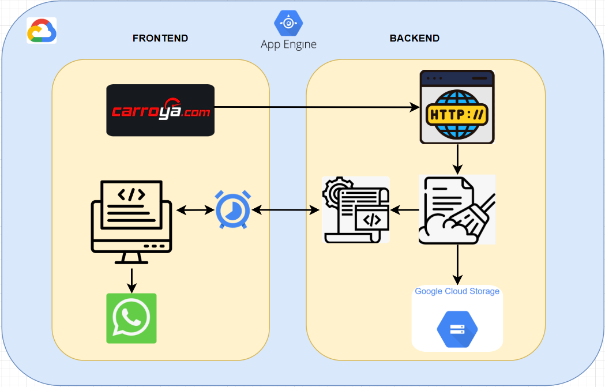

<h1 align="left">Scraper  -Web Site(Motorcycles)</h1>

###

[Sitio Web de Notificación](https://mi-repositorio.sharepoint.com/sites/mi-repositorio](https://aerobic-copilot-449214-n9.uc.r.appspot.com/)

 

<h4 align="left">Este proyecto permite realizar la extracción de información desde el sitio web Carroya - Motos(https://www.carroya.com/motos) . Los datos obtenidos son limpiados y almacenados en un archivo CSV, que posteriormente se guarda en un bucket de Google Cloud Storage. Además, cuenta con una interfaz en HTML y JavaScript que se encarga de generar un scrapeo cada vez que el usuario lo desee, así mediante WhatsApp se entrega una notificación de que proceso ha finalizado , junto a un archivo csv que el usuario puede descargar.  El proyecto está compuesto por los siguientes componentes:  1) Diagrama funcional 2)Scraping de Carroya.com 3)Procesamiento y limpieza de datos 4)Almacenamiento en Google Cloud 5)Notificación por WhatsApp 6) Deploy</h4>

###

 

<h3 align="left">1)Diagrama Funcional</h3>

###

  

###

 

<h3 align="left">2) Scraping de Carroya.com</h3>

###

 

<h4 align="left">-Code: "utils/scraper.py"  -Realizar una petición mediante el método XHR (XMLHttpRequest) en un request  -El Response obtenido es un JSON con los datos de consulta.</h4>

###

 

<h3 align="left">3) Procesamiento y limpieza de datos</h3>

###

 

<h4 align="left">-Code: "utils/cleaner.py"  -Realizar una petición mediante el método XHR (XMLHttpRequest) en un request  -El Response obtenido es un JSON con los datos de consulta.</h4>

###

 

<h3 align="left">4) Almacenamiento en Google Cloud Storage</h3>

###

 

<h4 align="left">-Code: "utils/cleaner.py"  -Se encarga de conectar con Google Cloud Storage.  -Sube el archivo CSV generado a un bucket específico.</h4>

###

 

<h3 align="left">5) Notificación por WhatsApp</h3>

###

 

<h4 align="left">-Code: "utils/notifier.py" - "templates/index.html" - "static/script.js" - "static/styles.css"  -Cuenta con un frontend en HTML y JavaScript.  -Envío de notificaciones mediante la implementación de la libreria Twilio  -Envía la notificación vía WhatsApp al usuario cuando el proceso ha finalizado.</h4>

###

 

<h3 align="left">6) Deploy</h3>

###

 

<h4 align="left">6.1) En local  6.1.1) Instalación -python -m venv env   6.1.2) Ejecución -Ejecutar ".\env\Scripts\activate" -Ejecutar "main.py" -Para desactivar el ambiente virtual, ejecutar "deactivate"  Nota: En "main.py" descomentar las lineas 46 y 47, comentar las lineas 48 y 49.  6.2) En Google Cloud  6.2.1) Ejecución -Ejecutar "gcloud auth login" -Configurar el proyecto , ejecutando "gcloud config set project [ID DEL PROYECTO]"  -Acceder a la carpeta en la cual se encuentra el proyecto a ejecutar, cd "[RUTA PROYECTO] -Ejecutar "gcloud app deploy"  Nota: En "main.py" comentar las lineas 46 y 47, descomentar las lineas 48 y 49.</h4>

###

  
  
  
  
  
  
  
  
  

###
